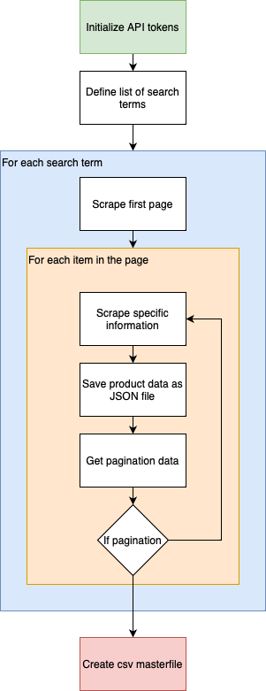
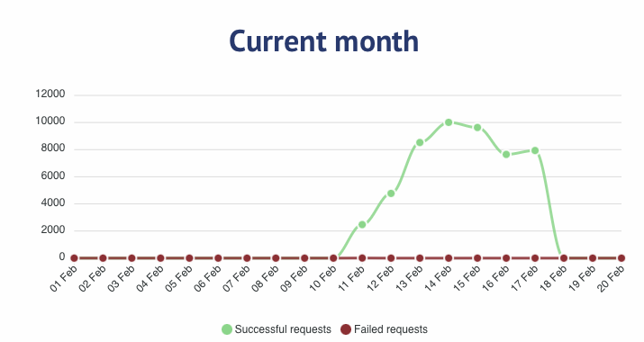

# amazon-recommender
## Abstract

Abstract here

## Problem Statement
Using [Crawlbase](https://crawlbase.com/dashboard), we built a dataset that consists of Amazon products. There are over 38,000 items across different categories such as bathroom, bedroom, television, smart watch, and more. Using content-based filtering we want to create a recommender that outputs suggested items to users. In this case, since we have the individual reviewers for each product, we will use them as “usersˮ. Here is an example entry of a “userˮ under a sample product.

## Methodology

### Summary

* Aggregate the harvested product data into one DataFrame Create the user matrix
* Go through each product and pick up all the reviewers
* Create the item matrix
    * Create feature vectors 
* Create the user-item matrix
    * Use matrix factorization
* Try different similarity measures (dot similarity, cosine similarity, etc.) Serve recommendations to select users
* Measure performance (top-k recommendations)
    * DCG
    * NDCG

### Specific Implementation Steps
#### Extract the data
We extracted the data by using the [Crawlbase API](https://crawlbase.com/dashboard) to crawl the Amazon website and scrape approximately 38,000 items. The process is as follows.

Over the period of February 10, 2024 to February 19, 2024, we crawled through a list of search terms and scraped each item under that search term.

We expended **50,000 Scraper API credits** and approximately **2000 Crawling API credits**. 

#### Clean the data
##### Programmtic Cleaning
We collated the userbase and itembase by first defining the categories as seen below. Then, for each of the 16 categories, we put all of the product data of each item in each subcategory into one DataFrame and consequently one CSV file. That means that for each category, there is 1 CSV file. Meaning, there are 16 CSV files because there are 16 categories. The initial cleaning was done programmatically for the prices and features.
* Check if the file is valid. Some files are just junk from the scraping process whilst others contain nothing important because the request failed.
* The `description` and `manufacturerProductDescription` columns were concatenated because there are items with no `description` but with a `manufacturerProductDescription` while there are items with `manufacturerProductDescription` and no`description`.
* Each string column was lowercased, stripped of forbidden special characters, and stripped of ASCII special characters.
* We take just the float version of the `customerReview`.
* We take just the number of the `Best Sellers Rank`.
##### Manual Cleaning
The cleaning does not stop there. We have to check each of the 16 files for contextually same features and merge them. For example, in Fashion, there is a feature where the following are present:
* Nike
* Nike Equipment
* Nike Golf
* Nike Apparel

They are tagged as different but they should be the same. This is where the manual cleaning comes in. We comb through all the features and merge the ones that are contextually the same.

#### Identified Categories
| Children         | Books               | Cleaning Material | Garage              | Kitchen          | Bedroom             | Living Room       | Bathroom           | Fashion         | Electronic devices   | Peripheral Devices | Computer Components | Mobile Accessories      | Personal Care | Car Stuff     | Office Supplies | Travel  Essentials |
|-----------------|---------------------|--------------------|---------------------|------------------|---------------------|-------------------|---------------------|-----------------|----------------------|--------------------|---------------------|-------------------------|---------------|---------------|-----------------|-------------------|
| action figures  | adventure novel     | vacuum             | garage              | utensils         | bedding             | carpet            | bathroom (accessories) | belt            | camera               | keyboard           | cpu cooler          | cables (phone chargers, extension, etc.) | conditioner   | car accessories| folder          | first aid (kits) |
| building toys   | fantasy novel       | detergent          | battery (includes household, automotive) | air fryer  | bedroom(accessories) | home décor       | mattress/items      | cap             | cellphone            | mouse              | gpu                 | chargers(mostly phone) | deodorant    | dash cam      | home_office     | luggage           |
| toddler toy     | historical novel    | mop                |                     | coffee maker     | toilet              | living room      | pillow              | coat            | headphones           | webcam             | hard drive          | phone case              | face wash    | gps (also includes watch type GPS) | notebook        | packing cubes     |
| toy airplanes   | mystery novel       | broom              |                     | frying pan       | playroom (also includes playroom furnitures) | ring doorbell    | air purifier        | dress           | laptop               | microphone         | intel amd processor | screen protector        | facial toner | ram vehicles  | school supplies | stanley cup (tumbler & accessories) |
| toy cars        | nonfiction novel    | dishwasher (mostly items for dishwasher maintenance) |                  | kitchen knife    | desk lamp           | wall mount       | washing machine     | face mask       | monitor              | printer            | motherboard         | tripod                  | feminine wash| tires         | stationary      | travel essentials |
| toy dolls       | romance novels      | fabric conditioner|                     | microwave        | iron(supplement & for clothes) |                    | air freshener       | jewelry         | smart watch          | projector          | pc chassis          |                         | lotion       | office chair  | water flask     |                   |
| baby bottle     | science fiction novel|                    | oven                | lamp (includes home and industrial) | curtain        | mirror            | men bag             | speakers        | usb                  | pc fan             |                    |                         | makeup       | seat cushion  | portable fan    |                   |
| baby formula    | thriller novel      |                    | over the counter (includes appliances, countertop stuff, and meds) | bedframe | coffee table        | linen             | men jeans           | surveillance camera | computer accessories| pc power supply     |                         | moisturizer  |               |                 |                   |
| baby wipes      | young adult novel   |                    | steamer             | bookshelf        | couch               |                   | men shirt           | tablet          | pc ram               |                    |                    |                         | mouthwash    |               |                 |                   |
| car seat*       |                     |                    | stove               | cabinet          | chair               |                   | men shoes           | television      |                      | solid state drive   |                    |                         |               |               |                 |                   |
| crib*           |                     |                    | kitchen             | desk             | furniture           |                   | men sweater         | videogame console    |                      |                    |                    |                         | shaving cream|               |                 |                   |
| diaper          |                     |                    | dining room (mostly chiars and tables) | dresser | patio (mostly furniture, also includes lamps, rugs, etc.) |                   | socks              | wifi router     |                      |                    |                         | shampoo      |               |                 |                   |
| nursery         |                     |                    | night stand         | patio (mostly furniture, also includes lamps, rugs, etc.) |                    |                     | underwear           |                    |                      |                    |                    |                         | soap         |               |                 |                   |
| pacifier        |                     |                    | table               |                  |                     |                    | women bag           |                    |                      |                    |                    |                         | tampon       |               |                 |                   |
| stroller        |                     |                    |                     |                  |                     |                    | women jeans         |                    |                      |                    |                    |                         | tissue       |               |                 |                   |
|                 |                     |                    |                     |                  |                     |                    | women shirt         |                    |                      |                    |                    |                         | toothbrush   |               |                 |                   |
|                 |                     |                    |                     |                  |                     |                    | women shoes         |                    |                      |                    |                    |                         | vitamins     |               |                 |                   |
|                 |                     |                    |                     |                  |                     |                    | women sweater       |                    |                      |                    |                    |                         |              |               |                 |                   |
|                 |                     |                    |                     |                  |                     |                    | workout clothes    |                    |                      |                    |                    |                         |              |               |                 |                   |

## Significance of the Study

## List of Tables

## List of Figures

## Preliminaries

## Conclusion

## Recommendations

